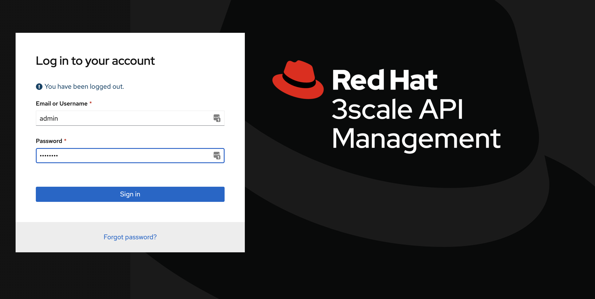

# Simple 3Scale Install Demo on Azure
Install docs for 3scale are pretty overwhelming due to all the options presented. I'm going to walk through a vanilla example of performing a basic install. 
I am specifically simplifying steps in [this guide][1]. Note, this guide is compiled from an install I did September 2020, if things have changed or you see a mistake [please write an issue here](https://github.com/dudash/openshift-simplified-3scale-aro-install/issues/new).

## Assumptions 
* You have an OpenShift cluster and are logged in with some admin rights

## Setup access to pull integration images from registry.redhat.io
Create a new service account here:
https://access.redhat.com/terms-based-registry/#/accounts

> It has a username: `1234567|arosharedcluster`
> And a password `a-bunch-of-letters-numbers-and-symbols-i-cant-share-with-you`

Now create a secret to hold those.

```
oc create secret docker-registry threescale-registry-auth --docker-server=registry.redhat.io \
  --docker-username="1234567|arosharedcluster" \
  --docker-password="a-bunch-of-letters-numbers-and-symbols-i-cant-share-with-you"
```

## Install the 3scale Operator
Now we can deploy an operator to manage our 3scale instance install. You'd probably know if it is already installed, but a quick check can be done (in your project namespace) by running:
`oc get subs`

Don't have it yet? Goto Operators->OperatorHub in the OpenShift webconsole, find it, and install it. As of right now the operator is version 0.6.0 and 3scale 2.9. Installing it with options: in your project namespace and using an `Automatic` approval strategy.

Now try `oc get subs` again and you should see something like:
> ```
> NAME              PACKAGE           SOURCE             CHANNEL
> 3scale-operator   3scale-operator   redhat-operators   threescale-2.9
> ```

## Setup access to provision AzureFile storage

### Setup the roles necessary for AzureFile
We need to [give the service account that binds storage additional access][2] so it can create an Azure access secret in our projects. By default ARO doesn't (currently) pre-configure this access, so create below resource to configure that (you can `oc create -f` the file in this repo):

```
apiVersion: rbac.authorization.k8s.io/v1
kind: ClusterRole
metadata:
  name: system:azure-cloud-provider-secrets
rules:
- apiGroups:
  - ""
  resources:
  - secrets
  verbs:
  - get
  - create
  ```

Now run:
`oc adm policy add-cluster-role-to-user system:azure-cloud-provider-secrets system:serviceaccount:kube-system:persistent-volume-binder`


### Setup a new RWX Storage class for 3scale to use
3Scale needs RWX persistent volumes. In Azure we can use AzureFile for this by creating a new storage class. We also will need to scope the storage class specifically to the project where 3scale will run (due to a known [limitation][3] with how AzureFile mounts to Linux)

Get your project's uid with:
`oc describe project YOUR_PROJECT_NAME | grep uid-range`

> You should see something like (note the first number is our uid):
> `openshift.io/sa.scc.uid-range=1000740000/10000`

Now we can create a storage class using that. Replace the uid in the yaml below with that uid you just got. Also, replace the name if you want to call it something more specific (like your actual project namespace name).
```
apiVersion: storage.k8s.io/v1
kind: StorageClass
metadata: 
  name: azure-file-myproject
mountOptions: 
- uid=PUT_IT_HERE
- gid=0
- mfsymlinks
- cache=strict
parameters: 
  skuName: Standard_LRS
provisioner: kubernetes.io/azure-file
reclaimPolicy: Delete
volumeBindingMode: Immediate
```

(You can start with the file in this repo, update, and `oc create -f`)


## Install 3Scale
We will create an APIManager custom resource which the operator will see and then do an installation for us. Note we set the FileStorageSpec to PVC in the template for the API Manager to match the StorageClass name we created earlier.

Also, in the below config (`my-apimanager.yaml`) update the wildcardDomain to match your OpenShift apps domain, check the namespace and storageClassName match what you just created, then `oc create -f` the file.

```
apiVersion: apps.3scale.net/v1alpha1
kind: APIManager
metadata:
  name: my-apimanager
  namespace: myproject
spec:
  system:
    fileStorage:
      persistentVolumeClaim:
        storageClassName: azure-file-myproject
  wildcardDomain: apps.jn5rg0sj.eastus2.aroapp.io
```

Now wait about 5 min for everything to come up. While you wait, check `oc get pvc` to make sure they all eventually create and goto a BOUND state. And also you can `oc get pods -w` to watch the pods go ready.

## Smoke test 3scale
Now let's do some 3scaley things

Get your login info with:
```
oc get secret system-seed -o json | jq -r .data.ADMIN_USER | base64 --decode
oc get secret system-seed -o json | jq -r .data.ADMIN_PASSWORD | base64 --decode
```

Find your URL with:
`oc get routes | grep admin`

> You see the second column has the URL:
> ```
> zync-3scale-provider-vxjt7   3scale-admin.apps.jn5rg0sj.eastus2.aroapp.io                           system-provider      http      edge/Redirect   None
> ```

Open that URL and walk through the intro tutorial. You're up and running and it looks like this:




[1]: https://access.redhat.com/documentation/en-us/red_hat_3scale_api_management/2.9/html/installing_3scale/install-threescale-on-openshift-guide#deploying-threescale-using-the-operator
[2]: https://docs.openshift.com/container-platform/4.3/storage/dynamic-provisioning.html#azure-file-definition_dynamic-provisioning
[3]: https://github.com/MicrosoftDocs/azure-docs/issues/17765